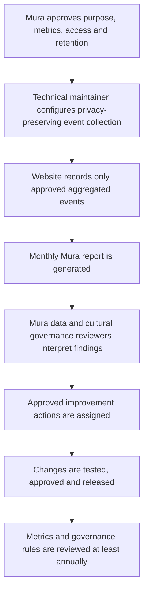

# Playgroup Website: Evaluation Metrics and Monthly Reporting Recommendation

**Prepared for:** Mura Kosker Sorority Inc.  
**Prepared by:** Manus AI  
**Status:** Recommended future capability. The current static Playgroup website does not collect user identities, activity events or download counts.

## 1. Purpose

Evaluation should show whether the Playgroup website is useful, accessible and culturally appropriate while collecting the minimum amount of information required. Mura should receive reporting that supports local decision-making: which resources are used, whether facilitators can plan sessions successfully, what materials need improvement, and whether access problems occur. The metrics must never be introduced merely because they are technically possible.

Any system that records worker identity, download activity, location, children, carers, cultural content or service use should be approved through Mura’s Zendath Kes data-governance process before development. Indigenous Data Sovereignty supports Aboriginal and Torres Strait Islander peoples and organisations controlling how data relating to them are collected, accessed, analysed, interpreted, managed, shared and reused.[1] [2]

## 2. Recommended metric set

| Metric group | Recommended measure | Suggested unit | Why it matters | Data-minimisation control |
|---|---|---|---|---|
| Resource use | Facilitator checklist downloads | Count per month | Shows whether preparation resources are being used. | Record resource type and month; do not collect client information. |
| Resource use | Facilitator guide downloads | Count per month | Indicates demand for hard-copy or offline guidance. | Use a pseudonymous staff identifier only if Mura approves “by who” reporting. |
| Planning use | Session plans created, saved and downloaded | Count per month | Shows whether the planner is practical for outreach work. | Avoid collecting the plan text or activity notes in central analytics. |
| Activity use | Activity pages opened and Digital Play card opened | Count per month and by activity type | Helps identify which activities need more guidance or approved resources. | Aggregate by activity type; do not associate with children or carers. |
| Quality | Optional facilitator feedback | Short rating and free-text theme | Identifies usability, gaps and training needs. | Make optional; review free text for cultural and privacy risk. |
| Access | Device type, page-load error and link error | Aggregated technical count | Supports accessibility and maintenance. | Do not use precise location or unnecessary device identifiers. |
| Governance | New content approvals, cultural-review status and asset-review due date | Status count | Confirms that new materials have passed Mura approval. | Keep the approval register under Mura control. |

## 3. “By who” reporting: recommended approach

Mura may reasonably want to know which outreach workers download checklists or use guides so it can offer support and understand workforce uptake. This should not be implemented as unbounded monitoring. The recommended method is optional authenticated access using a Mura-controlled staff account, with a **pseudonymous staff identifier** in the reporting data and a separate, restricted Mura-held mapping table. Only the approved manager should be able to resolve an identifier to a person.

The public site should never display download counts by named worker. Monthly leadership reports should use totals by workgroup or role. A named-worker view should be limited to the authorised Mura manager, used only for the agreed support or accountability purpose, and reviewed against an approved retention period.

| Field | Recommended collection | Access | Retention decision required |
|---|---|---|---|
| Event type | Checklist, guide, session-plan or QR download; activity view; error | Website reporting administrator | Mura chooses period, such as 12 months. |
| Event date | Month, and day only if needed for troubleshooting | Website reporting administrator | Retain only as long as needed for monthly reporting and troubleshooting. |
| Worker reference | Mura pseudonymous staff ID, only if approved | Authorised Mura manager | Mura chooses access and retention conditions. |
| Workgroup or role | Approved workgroup/role category | Mura reporting administrator | Review when worker changes role. |
| Session-plan content | **Do not centrally collect by default** | Local outreach device only | Follow Mura’s local retention procedure. |
| Child/carer information | **Do not collect in website analytics** | Not applicable | Not applicable. |

## 4. Monthly reporting dashboard

The monthly dashboard should provide a simple Mura-controlled view with a month selector, workgroup or role filter, and a clear statement of the reporting period. It should use plain-language headings and strengths-based interpretation. Recommended panels are: downloads by resource; planner use; activity-library use; Digital Play use; approved feedback themes; access errors; and content-approval status.

| Dashboard panel | Recommended graph | Decision supported |
|---|---|---|
| Downloads by resource | Monthly column chart, separated by checklist, guide and session-plan downloads | Which hard-copy or offline resources should be maintained or printed. |
| Planner use | Monthly line chart for plans created and plans downloaded | Whether the planner supports outreach workflow. |
| Activity-library use | Ranked horizontal bar chart by activity category | Which activity guides should be expanded or refreshed. |
| Digital Play | Monthly column chart for Digital Play page and resource-pack use | Demand for approved Digital Play cards and videos. |
| Feedback themes | Short theme table with example de-identified comments | Training, usability and content improvements. |
| Governance status | Traffic-light table for pending, approved and review-due content | Cultural and content-approval oversight. |

## 5. Reporting workflow and responsibilities

| Responsibility | Role | Required action |
|---|---|---|
| Governance approval | Mura CEO or delegate and nominated data/cultural governance lead | Approve metrics, purposes, fields, users, retention and reporting audience. |
| Technical configuration | Technical maintainer | Implement only approved tracking, access controls and reporting views. |
| Monthly review | Mura reporting administrator | Check the report for accuracy and provide a summary to authorised decision-makers. |
| Interpretation | Mura governance and program leads | Interpret findings in local context and agree actions. |
| Improvement | Content approver and technical maintainer | Update resources, training or website features after approval. |

## 6. Implementation sequence

The first release should retain the current local-first session planner without individual tracking. Mura can then approve a small first metric set—such as aggregate checklist, guide and session-plan downloads—before adding worker-level reporting. If Mura later requires secure login, staff identifiers, protected reporting dashboards, database storage or scheduled monthly reports, the website will need a Mura-controlled authenticated backend and documented security controls.

This staged approach keeps the immediate tool useful while allowing Mura to decide what data it wants to govern before it is collected.

## References

[1]: https://lowitja.org.au/wp-content/uploads/2023/10/328550_data-governance-and-sovereignty.pdf "Lowitja Institute, Indigenous Data Governance and Sovereignty"
[2]: https://www.ahuri.edu.au/analysis/brief/understanding-data-sovereignty-aboriginal-and-torres-strait-islander-people "AHURI, Understanding Data Sovereignty for Aboriginal and Torres Strait Islander people"
