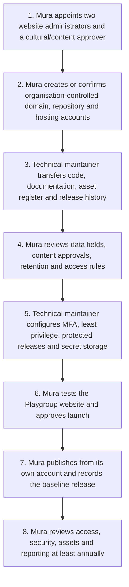

# Playgroup Website: Code Handover, Security and Data Sovereignty Plan

**Prepared for:** Mura Kosker Sorority Inc.  
**Prepared by:** Manus AI  
**Scope:** A proposed, generic handover arrangement for the separate **Playgroup** website, which will host Playgroup information and interactive resources outside the Mura Wellbeing website.

> This is an operational handover plan, not legal advice. Mura should have the final plan, intellectual-property terms and account arrangements reviewed by its authorised decision-makers and advisers before transfer.

## 1. Purpose and ownership outcome

The Playgroup website should be controlled by **Mura Kosker Sorority Inc.** rather than by an individual staff member, contractor or partner organisation. At handover, Mura should hold the organisation-level accounts for the source-code repository, website hosting, domain name, storage, analytics and any future reporting system. At least two Mura-nominated administrators should retain administrator access at all times.

The handover should cover the website source code, design files, activity content, downloadable resources, photo and cultural-content approval register, technical documentation, account register, release history and current security configuration. A separate account register should record who has access, why access is needed, the access level, approval date and review date.

| Asset or service | Proposed accountable owner | Minimum control at handover | Dependency before launch |
|---|---|---|---|
| Playgroup domain and DNS | Mura Kosker Sorority Inc. | Mura billing contact and two domain administrators | Final domain name and renewal contact approved. |
| Source-code repository | Mura-controlled GitHub organisation or private repository | Two Mura organisation owners; protected main branch | Mura organisation or repository created. |
| Website hosting | Mura-controlled hosting account | Two Mura administrators and verified billing contact | Hosting account and deployment owner confirmed. |
| Website content and cultural material | Mura Kosker Sorority Inc. | Approved content and asset register | Mura approval process confirmed. |
| Session plans, downloads and future analytics | Mura Kosker Sorority Inc. | Data-governance decision, retention schedule and access register | Governance approval before collection begins. |

## 2. Zendath Kes Data Sovereignty

This plan uses the user-requested project term **“Zendath Kes Data Sovereignty.”** Public sources commonly spell Torres Strait as **“Zenadth Kes”;** Mura’s preferred spelling should be adopted in the final policy. The governance principle is that Mura controls how information relating to its families, community, activities, knowledge and cultural material is collected, accessed, used, interpreted, shared, stored, retained and returned.

Indigenous Data Sovereignty is described as the right of Aboriginal and Torres Strait Islander peoples, communities and organisations to maintain, control, protect, develop and use data relating to them. It is put into practice through Indigenous data governance: community-led decision-making over the full data lifecycle, not only technical data security.[1] [2]

> “Indigenous Data Governance” is the right of Indigenous peoples to autonomously decide what, how and why Indigenous data are collected, accessed and used.[2]

For the Playgroup website, Mura should approve the purpose of each collection, the fields collected, access rights, reporting format, retention period, any sharing arrangement, and the process for changing or removing content. Mura should also receive reporting back in a meaningful, strengths-based form that supports local decision-making rather than external reporting alone.[1] [2]

| Data-sovereignty practice | How it applies to the Playgroup website | Mura decision required |
|---|---|---|
| Community purpose | Collect only information needed to support Playgroup delivery, planning and agreed reporting. | Approve purpose and data-minimisation rules. |
| Free, prior and informed consent | Explain what is collected, why, who can access it, how it will be stored and whether it will be shared. | Approve consent language and when consent is required. |
| Mura control | Mura controls accounts, access, reporting and reuse of content, activity data and cultural material. | Nominate authorised owners and approvers. |
| Cultural safety | Do not upload, publish or reuse stories, language, photos, video or traditional knowledge without the appropriate Mura approval. | Maintain an approval register. |
| Meaningful return | Provide monthly summaries and local reporting that Mura can understand and use. | Agree report format and audience. |
| Review and remedy | Review access, retention and third-party arrangements; provide a process for withdrawal, correction and incident response. | Approve review cycle and escalation contact. |

## 3. Required security controls

The website currently stores session plans in the local browser of the outreach computer and produces a PDF locally when the facilitator selects download. No session-plan content is sent to the website by this process. However, browser storage and downloaded files can still be accessed by another person using the same device or browser profile. Mura should therefore require managed, password-protected devices and a documented process for clearing browser storage when a worker changes device, role or location.

| Security area | Required control | Owner | Dependency |
|---|---|---|---|
| Account access | Multi-factor authentication for all administrator accounts; two Mura organisation owners; individual accounts only. | Mura account administrator | Organisation-controlled accounts. |
| Permissions | Least-privilege access; separate content, code and hosting roles; remove access promptly when roles change. | Mura website administrator | Access register and staff-offboarding process. |
| Code integrity | Protected main branch, peer review for changes, release tags and dependency/security scanning. | Technical maintainer | Mura repository ownership. |
| Secrets and credentials | Store keys in the hosting provider’s secret manager; never place keys, passwords or API tokens in source code, PDFs or email. | Technical maintainer | Secure secret-management process. |
| Devices and downloads | Use encrypted, password-protected outreach devices; store downloaded plans in an approved Mura folder; delete local copies when no longer required. | Outreach lead | Mura device and retention procedures. |
| Data collection | Do not add sign-in, individual child, carer or download-tracking data until Mura approves data fields, access and retention. | Mura data-governance lead | Zendath Kes data-governance decision. |
| Incident response | Keep an incident contact, record suspected access or disclosure, contain access, assess impact, notify Mura and document the remedy. | Mura executive delegate | Incident-response contact list. |

## 4. Step-by-step handover flowchart

| Step | Responsible role | Output | Dependency |
|---|---|---|---|
| 1 | Mura CEO or delegate | Named administrators, content approver and technical contact | Mura internal nomination. |
| 2 | Mura administrators | Organisation-controlled accounts and domain | Account/billing authority. |
| 3 | Technical maintainer | Source code, documentation, asset register and release tag | Mura repository access granted. |
| 4 | Mura governance and cultural/content approvers | Approved data and content rules | Mura review meeting. |
| 5 | Technical maintainer with Mura administrator | Secure configuration and access register | Mura account control. |
| 6 | Mura test group | Launch approval or correction list | Completed test environment. |
| 7 | Mura administrator | Live Playgroup website under Mura control | Signed-off release. |
| 8 | Mura governance lead and technical maintainer | Annual review record and update plan | Current access register and reporting summary. |

## 5. Acceptance checklist

Before the final handover is accepted, Mura should confirm that it can log in to the repository, hosting account, domain account and analytics/reporting account without relying on a former contractor. The main branch must be protected, administrator accounts must use multi-factor authentication, active access must be recorded, and the asset register must identify approval status for every photograph, video, story, language resource and downloadable guide.

Mura should also confirm that the Playgroup website does not collect personal or culturally sensitive information beyond what has been approved. Any later feature that identifies workers, families, children, downloads or use patterns must pass Mura’s data-governance approval before it is enabled.

## References

[1]: https://lowitja.org.au/wp-content/uploads/2023/10/328550_data-governance-and-sovereignty.pdf "Lowitja Institute, Indigenous Data Governance and Sovereignty"
[2]: https://www.ahuri.edu.au/analysis/brief/understanding-data-sovereignty-aboriginal-and-torres-strait-islander-people "AHURI, Understanding Data Sovereignty for Aboriginal and Torres Strait Islander people"
