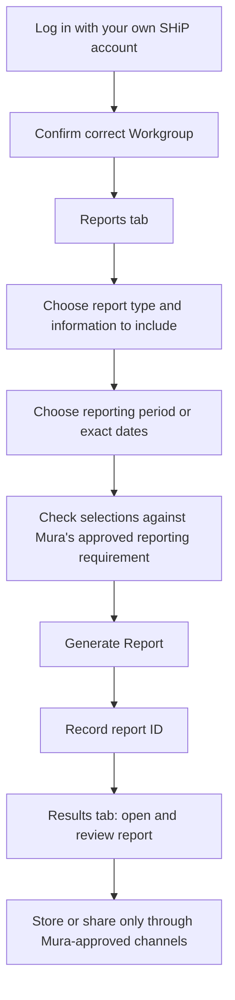

# Reporting on SHiP: Simple Outreach-Worker Instructions

**Prepared for:** Mura Moegi Kaziw Sagulau Playgroup outreach workers  
**Prepared by:** Manus AI  
**Source:** SHiP User Guide — July 2011, version 1.4, supplied by the user.

> These instructions summarise the supplied 2011 guide. The current SHiP interface, organisational procedures and user permissions may differ. Follow Mura’s current SHiP procedures and ask the site administrator if your screen, report options or workgroup names are different.

## 1. How the Playgroup download supports confidentiality and local ownership

The Playgroup website has been designed so a session plan is built in the browser on the outreach worker’s computer. When the worker selects **Download PDF**, the browser creates the PDF directly on that computer; the session-plan information is not transmitted to the Playgroup website. The website keeps saved plans only in that browser’s local storage until the worker deletes them or clears browser data.

This design supports confidentiality and Mura ownership because the worker can maintain the working plan in the approved local device and transfer only the necessary, authorised information into SHiP. It does **not** replace normal information-security controls. A saved browser plan or downloaded PDF may still be visible to another person who can access the same device or browser profile. Use a password-protected, encrypted Mura-approved device, store files in the approved local folder, avoid entering client-identifying information in the Playgroup planner, and delete temporary copies when Mura’s retention process permits.

| Playgroup website action | Where the information stays | Good practice before SHiP reporting |
|---|---|---|
| Build or save a session plan | Local browser storage on the worker’s device | Use only required session details; do not place client identifiers in the planner. |
| Download a plan or checklist | Directly to the worker’s computer | Save to the approved Mura location with a clear, date-based file name. |
| Read plan for reporting | Local PDF or printed copy | Enter only the authorised information into SHiP. |
| Finish reporting | Mura-approved local file store / SHiP | Close SHiP, lock the device and delete temporary copies where appropriate. |

## 2. Before you start

Open the SHiP website address assigned to your organisation. Enter your organisation-issued username and password, then select **Submit**. The supplied guide notes that usernames are case-sensitive, that an account can be locked after five unsuccessful attempts, and that an account may also be locked after more than six weeks without access.[1]

Do not share your account with another worker. If you cannot log in, stop after the relevant number of attempts and contact the site administrator. Confirm that you are working in the correct **Workgroup** before you create, view, export or report on information. The guide describes Workgroups as the base level of reporting and explains that visibility can vary according to Cluster, Workgroup and user access level.[1]

## 3. Generate a standard SHiP report

1. Select **Reports** from the left navigation.
2. On the **Reports** tab, select the correct **Workgroup** and **Report type**.
3. From **Include in report**, select the information that the approved report requires.
4. Choose the **Report period**. If an exact period is required, use the calendar icon to enter the start and end dates.
5. Check the Workgroup, report type, data included and dates before proceeding.
6. Select **Generate Report**.
7. Note the report ID shown in the “Report Submitted” message.
8. Select the **Results** tab and use the report ID to open the completed report.[1]

## 4. Create or export a list

Use a **List** when the approved task requires a detailed data list rather than an aggregated report.

1. Select **Reports**, then select the **Lists** tab.
2. Choose the correct **Workgroup** and **List type**.
3. Choose the information from **Include in list**.
4. If available and approved, select a specific profile. Select **Include Names** only when names are necessary and your Mura process authorises it.
5. Select the **Period of Interest**, or enter a date range using the calendar icon.
6. Choose **View List** to view the output through the Results tab, or choose **Export List** only when an Excel file is necessary for the approved purpose.[1]

An exported list may contain sensitive information. Store it only in the approved Mura location, do not email it from a personal account, and do not copy it into the Playgroup website planner.

## 5. Financial or referral report

For a financial report, select **Reports**, then **Financial**. Choose the Workgroup and List type, select the preferred **Order/Subtotal by** value, choose the **Period of Interest**, and then select **View List** or **Export List**.[1]

For a referral report, select **Reports**, then **Referrals**. Choose the Workgroup and Report type, choose the Report period, select **Generate Report**, note the report ID, and retrieve the result from the **Results** tab.[1]

## 6. Simple quality and confidentiality check

Before you save, export or share a SHiP output, pause and check that you have selected the right Workgroup, date range and approved report type. Confirm that personal names appear only when necessary and authorised. Read the Results output for obvious omissions, duplicate records or unexpected information. If you think a report has been generated with the wrong settings, do not distribute it; contact the responsible Mura supervisor or SHiP site administrator for the correct process.

## Reference

[1] *SHiP User Guide*, July 2011, version 1.4, supplied by the user. Relevant sections: 1.0–2.1, 6.0–6.5 and 8.0.
